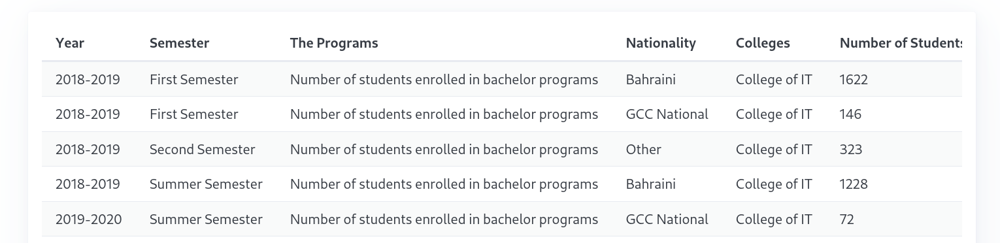

# JavaScript API Data Retrieval and Visualization Assignment

## Deadline
***Saturday 14/12/2024***

## Objective
In this assignment, you will work in pairs to create a JavaScript application that retrieves and displays UOB student nationality data from the Bahrain Open Data Portal using their public API.

## Background on APIs
An API (Application Programming Interface) is a set of rules and protocols that allows different software applications to communicate with each other. APIs enable developers to access and interact with data and services from external sources. In this assignment, you'll use a web API to retrieve educational statistics.

For more information about APIs, refer to the comprehensive Wikipedia article: https://en.wikipedia.org/wiki/API

## Dataset Overview
Dataset Link: [University of Bahrain Students Enrollment by Nationality](https://data.gov.bh/explore/dataset/01-statistics-of-students-nationalities_updated)

This dataset offers a comprehensive view of student demographics at the University of Bahrain, providing valuable insights into the institution's student composition and enrollment trends.

## Assignment Details

### Task 1: Data Retrieval
- Use the provided link to fetch data from the Bahrain Open Data Portal API
- Parse the JSON response

**Endpoint URL:**
- [https://data.gov.bh/api/explore/v2.1/catalog/datasets/01-statistics-of-students-nationalities_updated/records?where=colleges%20like%20%22IT%22%20AND%20the_programs%20like%20%22bachelor%22&limit=100](https://data.gov.bh/api/explore/v2.1/catalog/datasets/01-statistics-of-students-nationalities_updated/records?where=colleges%20like%20%22IT%22%20AND%20the_programs%20like%20%22bachelor%22&limit=100)

- [MDN Fetch API Page](https://developer.mozilla.org/en-US/docs/Web/API/Fetch_API)
- [Notes: Fetch API](https://github.com/ITCS333/notes/blob/main/md/ch7.md#javascript-fetch)

### Task 2: Data Visualization
- Create an HTML table to display the retrieved data
- Use Pico CSS (or similar frameworks) for responsive design and overflow handling
- Implement a clean, readable table layout

- Referance Links:
  - [Pico CSS Overflow Auto](https://picocss.com/docs/overflow-auto)
  - [Pico CSS Table](https://picocss.com/docs/table)

**Sample Output:**

### Submission Requirements
1. Create a public GitHub repository
2. Include a README.md with:
   - Names of both team members
   - Student IDs
3. Implement clean, commented code
5. Use responsive design principles

### Grading Criteria
- Successful API data retrieval
- Proper data parsing
- Responsive table design
- Code readability
- GitHub repository

### Submission
- Submit the GitHub repository link on the Blackboard
- Ensure the repository is public after the submission deadline

***Happy hacking!***