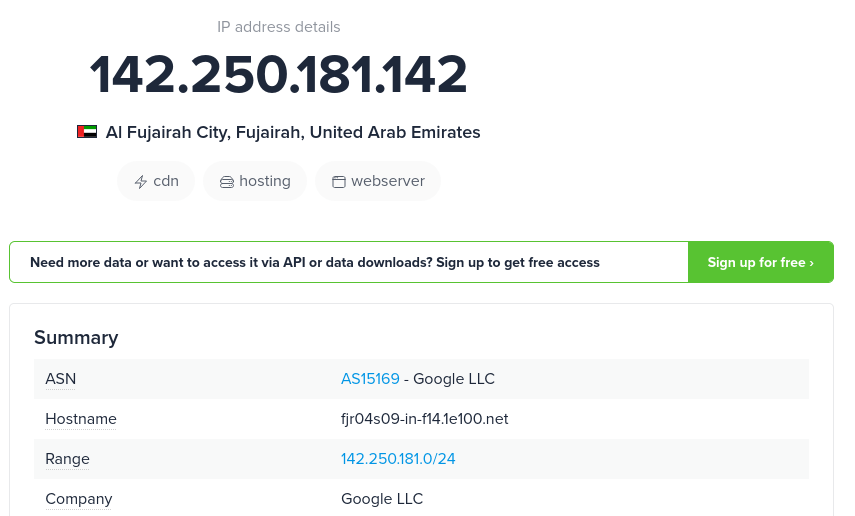

# Logistics
- Course website: [https://itcs333.github.io](https://itcs333.github.io)
- We will use it for:
    - Slides
    - Notes
    - Course Outline
    - etc.
- I will not upload material to teams / blackboard
- Teams will be used for announcements / questions
- Blackboard will be used for assignments and grades

# Overview
- A brief history of the Internet and the Web
- What happens when you enter a URL into a browser?

# A Brief History of the Internet
## Early Days

- **1960s**: The birth of the Internet
  - ARPANET: The first packet-switching network
  - Funded by the U.S. Department of Defense
  - Aimed to create a network that could survive partial outages
- **1970s**: Development of TCP/IP
  - Transmission Control Protocol (TCP) and Internet Protocol (IP)
  - Foundation of modern networking

](../img/ARPANET_first_router_2.jpg){height=50%}

## The Birth of the Web

- **1989**: Tim Berners-Lee invents the World Wide Web
  - Proposed a system for sharing information using hypertext
  - Introduced three key technologies:
    1. **HTML**: Hypertext Markup Language (Document structure)
    2. **URI**: Uniform Resource Identifier (Addressing)
    3. **HTTP**: Hypertext Transfer Protocol (Communication)

](../img/tim.jpg){height=100%}

## The First Website
- **1991**: The first website goes live at CERN
  - [Link to the first website](http://info.cern.ch/hypertext/WWW/TheProject.html)
  - [line-mode browser](http://line-mode.cern.ch/www/hypertext/WWW/TheProject.html)

## The Web’s Evolution

- **1990s**: The Web goes mainstream
  - Birth of **Mosaic**, the first popular web browser
  - Rise of companies like **Netscape** and **Yahoo!**
- **2000s**: Web 2.0 and interactivity
  - User-generated content (e.g., blogs, social media)
  - **AJAX**: Asynchronous JavaScript and XML
- **2010s - Today**: The mobile and responsive web
  - Growth of mobile browsing
  - Responsive design and Single Page Applications (SPAs)

# What Happens When You Enter a URL?

Let's break it down step by step...

## Step 1: You Enter a URL
- You type a URL like `https://www.uob.edu.bh` into the browser's address bar
- What does a URL consist of?
  - **Protocol**: `https://`
  - **Domain name**: `www.example.com`
  - **Port** (optional): :80
  - **Path** (optional): `/about`, `/products`
  - etc.

](../img/URI_syntax_diagram.svg){width=100%}

## Step 2: DNS Lookup

- The browser needs to convert the domain name to an IP address
- It queries the **DNS (Domain Name System)** to find the IP address
  - Example: `www.google.com` → `142.250.181.142`
- If the browser has the IP cached, it skips this step

{width=100%}

## Step 3: Browser Initiates a TCP Connection

- The browser establishes a **TCP connection** with the server
  - Uses the IP address from the DNS lookup
  - Connects on port **80** for HTTP or **443** for HTTPS

](../img/IP_stack_connections.svg){width=60%}

## Step 4: Sending an HTTP Request
- The browser sends an **HTTP request** (or **HTTPS** if secure)
  - Example: `GET /index.html HTTP/1.1`
  - Includes headers like `Host: www.example.com`
- If using HTTPS, the request is encrypted via **TLS (Transport Layer Security)**

## Step 5: Server Processes the Request
- The server receives the request and processes it
  - Checks the requested resource (e.g., `index.html`)
  - Executes any server-side logic (e.g., PHP, Node.js)
- The server generates an **HTTP response** and sends it back

## Step 6: Browser Receives the Response
- The browser receives the **HTTP response**
  - Common response codes:
    - `200 OK`: Success
    - `404 Not Found`: Resource not found
    - `500 Internal Server Error`: Server issue
    - `418 I'm a teapot`: [HTCPCP](https://en.wikipedia.org/wiki/Hyper_Text_Coffee_Pot_Control_Protocol)
- The response contains:
  - **HTML**, **CSS**, **JavaScript**, images, etc.

## Step 7: Rendering the Page
- The browser parses the **HTML** and builds the **DOM (Document Object Model)**
  - Downloads and applies **CSS** for layout and styling
  - Executes **JavaScript** for interactivity
- The final output is displayed to the user

## Step 8: Additional Requests
- The browser may initiate additional requests for resources:
  - Images, CSS files, JavaScript files, etc.
- These are fetched using separate HTTP requests
- Browser optimizations:
  - **Caching**: Reusing resources from previous requests
  - **Lazy loading**: Loading resources only when needed

## Recap: What Happens When You Enter a URL?

1. URL is parsed
2. DNS lookup to get IP
3. TCP connection established
4. HTTP request sent
5. Server processes the request
6. Response is sent back
7. Browser renders the page
8. Additional resources are fetched

](../img/Client-server-model.svg)

# Final Thoughts
- The web is constantly evolving, but the underlying mechanics still rely on the same principles
- Understanding how the web works is the foundation for becoming a proficient web developer
- In the next lecture, we’ll dive deeper into HTML, CSS, and JavaScript